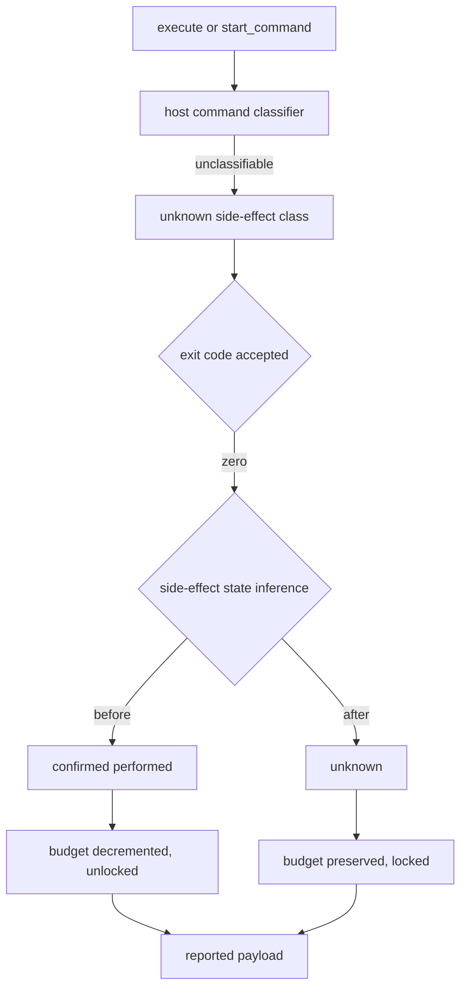
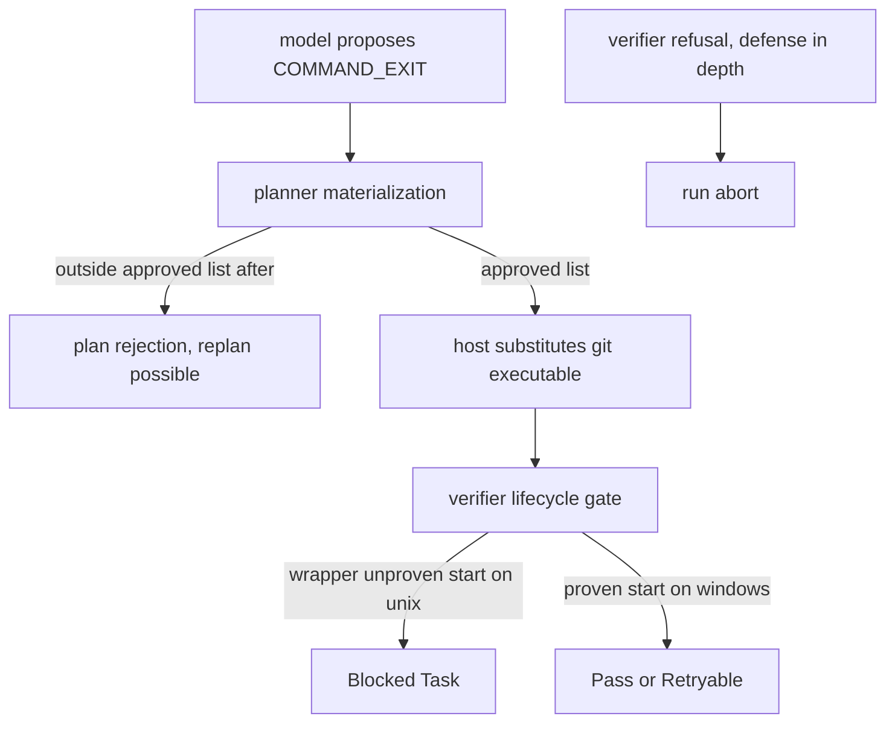
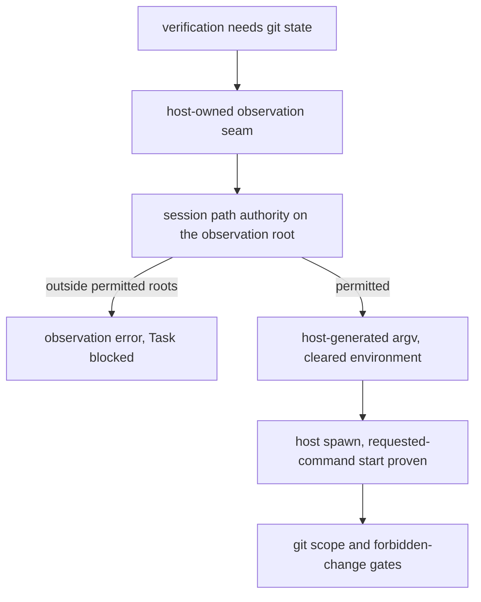

# User-Visible Regression Report

## Scope

- Scope kind: `working tree`
- Baseline: `f899ad31033540d666389d2520fd040fe267cbc7`, the completed managed worktrees phase 4 head
- Target: `working tree` on branch `security/verifier-classifier-closure-v1`
- Requested outcome: audit and fix, then push and run the full matrix
- Comparison method: `git --no-pager diff HEAD` plus the three new untracked modules, compared against `git --no-pager show f899ad3:<path>` for the pre-change behavior
- Requirements consulted: the task brief sections 0 through 27, `SECURITY.md`, `README.md` lines 167 through 320, and the two frozen design documents
- Note: the diff is security work whose headline effect is that some previously-working things stop working. The audit therefore separates an intentional security restriction from an accidental loss of safe supported behavior, which is the distinction the brief asks for.

## Gate Snapshot

- Recommendation: `Discuss`
- Completion: `Complete within reviewed scope`
- Why now: every accidental loss found by this audit has been fixed in the working tree, and what remains open is one deliberate product decision plus platform legs this host cannot execute.
- Must-review now:
  1. `F1` a rejected verification command used to wedge the Goal; it is now a recoverable plan rejection
  2. `F2` the host-owned Git observation had dropped Session path authority on its working directory; it is restored
  3. `I1` a command-exit verification is satisfiable on no platform today
- Full result: see `Complete Findings Index`; the intentional list is deliberately longer than the defect list.
- Findings count: `Block 0 | Discuss 1 | Watch 4 | Intentional 6`
- Coverage confidence: `high` for the result payload and orchestrator outcomes on unix; `medium` for windows and linux
- Behavior graph coverage: three shallow behavior graphs built for the execute payload, the verification command path, and the approval UI; the remainder is direct path evidence
- Biggest blind spot: no windows or linux execution, so the platform legs rest on code traces and the matrix

## Complete Findings Index

| ID | Action | Surface | One-line user-visible outcome | Intentional | Confidence |
| --- | --- | --- | --- | --- | --- |
| `F1` | `Discuss` | Goal run via `goal_run` | A plan carrying a verification command outside the host-approved list now produces a recoverable plan rejection instead of aborting the run and re-selecting the same Task forever | no | high |
| `F2` | `Discuss` | Verifier Git scope gate | The Verifier's own Git observation re-checks Session path authority, so a Session whose permitted roots are narrower than the Git top level is again blocked rather than silently observed | no | high |
| `W1` | `Watch` | `execute` / `start_command` result payload | A successful command the host cannot classify now reports an unknown side-effect state with a locked budget instead of a confirmed effect with a spent budget | yes | high |
| `W2` | `Watch` | `execute` / `start_command` result payload | Many read-only Git invocations now report an unknown class instead of a side-effect-free class, because the option tables are exact | yes | high |
| `W3` | `Watch` | `execute` / `start_command` result payload | `git fetch`, `git pull`, and `git clone` are now classified as remote mutations, so a failing one blocks instead of falling through | yes | high |
| `W4` | `Watch` | approval console | The Verifier's internal Git observation reports itself to the approval console again and shows the exact argv in a windows approval prompt | no | high |
| `I1` | `Intentional` | `VerificationSpec::CommandExit` | Only a fixed list of exact read-only Git observations may be proposed; builds, tests, scripts, shells, and interpreters are refused before any process starts | yes | high |
| `I2` | `Intentional` | `VerificationSpec::CommandExit` | On linux and macos a proposed observation cannot complete, because the sandbox wrapper cannot prove the requested command started | yes | high |
| `I3` | `Intentional` | `execute` / `start_command` result payload | A symbolic-ref update or delete, and a branch or tag created with a rendering flag, are now reported as mutations rather than as side-effect free | yes | high |
| `I4` | `Intentional` | `execute` / `start_command` result payload | A missing executable behind a sandbox wrapper is reported as a missing tool rather than a permission failure | yes | high |
| `I5` | `Intentional` | Verifier internal Git observation | The Verifier's own Git state is read by a narrow host-owned seam rather than by a model proposal | yes | high |
| `I6` | `Intentional` | windows approval | The number of operator prompts for a Git-observing verification is unchanged on windows; only the prompt text changes | yes | high |

## Block

`None.`

## Discuss

### F1 Discuss - A rejected verification command used to wedge the Goal; it is now a recoverable plan rejection

User impact: A Goal whose plan proposes a verification command outside the host-approved list used to stop the whole run with a low-authority error, leave the Task stuck in verification, and be re-selected by every later run, so the Goal never progressed and showed no blocker.
Review reason: this is the one place where the closure turned an intentional restriction into an availability regression rather than into a clear refusal.
Surface: Goal execution and plan materialization
Confidence: High

Look here first:
- [planner validation](/Users/yuta/local-mcp-connector-parity/src/planner.rs#L895)
- [verifier refusal](/Users/yuta/local-mcp-connector-parity/src/verifier.rs#L518)

Behavior delta:
- Before: the Verifier refused a shell or mutating command with a hard error, the run aborted before any verification result was recorded, and the Task stayed in verification while the scheduler kept re-selecting it. This existed at baseline but only two narrow argv shapes reached it.
- After: the same refusal still exists in the Verifier as defense in depth, but the planner now refuses the plan at materialization, which is a bounded, recoverable rejection the planner can be asked to revise. The amplified trigger set therefore never reaches the wedging path.

Evidence:
- traced the abort path from the specification evaluation through the run, the scheduler's verifier-first action for a verifying Task, and the runner's immediate return
- `planner::tests::an_unverifiable_command_exit_is_refused_when_the_plan_is_materialized` proves seven unapprovable shapes are refused and three approved shapes are accepted
- one replanner fixture used `printf a` as a verification command and had to change; that is the new rejection working as designed

Reviewer action:
Settle the product question in `I2`. If a command-exit verification is not expected to work on any platform, consider also refusing the verification kind outright at plan time so the planner is told once rather than per shape.

### F2 Discuss - The host-owned Git observation had dropped Session path authority on its working directory; it is restored

User impact: When a Session's permitted directories are narrower than the Git top level, the Verifier's Git observation could run outside the Session's declared roots, turning a deterministic block into a possible pass. The closing change restores the block.
Review reason: this is the only place where the change widened a boundary instead of narrowing one, so it is worth a second look even though it is now fixed.
Surface: Verifier Git observation
Confidence: High

Look here first:
- [authority check](/Users/yuta/local-mcp-connector-parity/src/verifier_git_observation.rs#L209)
- [removed path](/Users/yuta/local-mcp-connector-parity/src/execution.rs#L101)

Behavior delta:
- Before: the observation ran through the generic command path, which validated its working directory against the Session's permitted roots. A Git top level above those roots made the observation fail, which blocked every mutating Task that needed it.
- After: the first version of the seam canonicalized the root and only checked that it contained the Session's root, so a Git top level that is an ancestor of the Session root was accepted. The seam now re-checks Session path authority on every directory it runs in, and the observation in that shape fails exactly as it did before.

Evidence:
- traced the working-directory validation the generic command path performed and confirmed the seam did not
- `observation_refuses_a_root_outside_session_authority` proves the refusal for a narrowed Session and proves the same observation succeeds once the root is permitted, so the failure is the authority check and nothing incidental

Reviewer action:
Accept. The seam is unsandboxed, so the argv and environment envelope plus this authority check are what constrain it; `host_owned_observation_writes_nothing_anywhere` and `host_owned_observation_never_runs_a_repository_chosen_program` hold the envelope.

## Watch

### W1 Watch - An unclassified successful command now reports an unknown state with a locked budget

User impact: For any command the host cannot classify, a zero exit now reports an unknown side-effect state and a locked budget instead of a confirmed effect with a decremented budget. A client that reads the remaining-budget fields now sees budget remaining and the budget locked at the same time, a combination that previously only appeared on failures.
Review reason: the correction is right and matches the documented rule that an unknown state locks the budget, but it changes two documented payload fields for a broad set of commands.
Surface: `execute` and `start_command` result payload
Confidence: High

Look here first:
- [state inference](/Users/yuta/local-mcp-connector-parity/src/fallback.rs#L1308)
- [budget transition](/Users/yuta/local-mcp-connector-parity/src/fallback.rs#L818)

Behavior delta:
- Before: unknown class plus a successful exit produced a confirmed effect, which consumed one attempt and one effect from the budget and left it unlocked.
- After: the same input produces an unknown state, which leaves the counters and locks the budget. No executable authority is gained either way, because the executable fallback gate requires an unlocked budget with both counters non-zero.

Evidence:
- `the_unknown_state_locks_rather_than_replenishes_budget` asserts the lock and that the exact executable-fallback precondition is unsatisfiable
- no in-repository consumer reads these fields; they are reported for the caller

Reviewer action:
Approve with the caveat that the payload documentation does not enumerate which commands land in the unknown class. Not changed here, because the payload shape is a public contract and adding fields is a design change beyond this closure.

### W2 Watch - Many read-only Git invocations now report an unknown class

User impact: Invocations such as a bare `git status`, a `git log` with common formatting flags, or a `git diff` with a stat option now report an unknown side-effect class where they previously reported a side-effect-free class. The commands still run and behave identically; only the reported classification changed.
Review reason: the polarity is the intended fail-closed behavior, but the affected set is much wider than the status case the code comments name.
Surface: `execute` and `start_command` result payload
Confidence: High

Look here first:
- [query tables](/Users/yuta/local-mcp-connector-parity/src/git_command_class.rs#L488)
- [status rule](/Users/yuta/local-mcp-connector-parity/src/git_command_class.rs#L425)

Behavior delta:
- Before: a fixed subcommand list was treated as side-effect free regardless of options.
- After: every option must appear in that command's table, so an unlisted formatting option yields the unknown class. Execution and output are unchanged.

Evidence:
- diffed the pre-change subcommand arms against the new tables
- `the_windows_executable_spelling_classifies_identically` pins a representative set on both executable spellings

Reviewer action:
Approve with the caveat that operators watching the classification field will see more unknowns. This is the direction the brief requires.

### W3 Watch - Fetch, pull, and clone are now classified as remote mutations

User impact: A failing `git fetch`, `git pull`, or `git clone` now reports a remote mutation and blocks, where it previously fell through to an unknown class and was allowed to diagnose. This matches the documented rule that a remote mutation with an unknown effect is a terminal block.
Review reason: an accuracy improvement that nonetheless changes a reported decision for three common commands.
Surface: `execute` and `start_command` result payload
Confidence: High

Look here first:
- [remote mutation list](/Users/yuta/local-mcp-connector-parity/src/git_command_class.rs#L636)
- [remote branch](/Users/yuta/local-mcp-connector-parity/src/fallback.rs#L949)

Behavior delta:
- Before: those three subcommands were absent from the remote-mutation list, so they classified as unknown and the documented remote rule never applied to them.
- After: they classify as remote mutations, so the documented rule applies. No executable retry is created either way.

Evidence:
- compared the pre-change arms, which listed only push and the two pack subcommands
- the full suite passes, including the existing remote-ambiguity and remote-performed cases

Reviewer action:
Approve with the caveat.

### W4 Watch - The approval console no longer lost the Verifier's internal Git observation

User impact: The approval console had stopped showing any line for the Verifier's internal Git observation, so on windows an operator saw a permission prompt with nothing to explain it. The closing change prints the same running line the generic command path printed and shows the exact argv in the prompt.
Review reason: an operator-facing audit trail is a security affordance, not a cosmetic detail.
Surface: approval console
Confidence: High

Look here first:
- [activity line](/Users/yuta/local-mcp-connector-parity/src/verifier_git_observation.rs#L228)
- [approval detail](/Users/yuta/local-mcp-connector-parity/src/verifier_git_observation.rs#L215)

Behavior delta:
- Before: the generic command path emitted a running line and a fallback trace for every invocation.
- After: the seam emitted nothing at all, so the observation was invisible.
- Final: the seam emits a running line naming the observation and its directory, and the windows approval prompt carries the full argv, matching the auditability of the path it replaces.

Evidence:
- traced both activity emissions in the generic command path and confirmed the seam omitted them
- the operation label and the requested directory are unchanged, so the existing windows approval test's expectations still hold

Reviewer action:
Approve.

## Intentional Changes

| ID | User-visible change | Evidence |
| --- | --- | --- |
| `I1` | A command-exit verification now admits only a fixed list of exact read-only Git observations. Generic executables, all shells and interpreters, all mutating Git, and status and diff are refused before any process starts, and the executable is replaced with the host-resolved Git. The brief accepts this explicitly and directs that build and test support be deferred to a future explicit design. | [authority](/Users/yuta/local-mcp-connector-parity/src/verifier_command_authority.rs#L59) |
| `I2` | On linux and macos a proposed observation cannot complete, because the sandbox wrapper cannot prove the requested command started. On windows the command path is additionally approval-gated. The brief requires the wrapper's completion to stop standing in for the command's completion. | [lifecycle](/Users/yuta/local-mcp-connector-parity/src/sandbox.rs#L218), [pass rule](/Users/yuta/local-mcp-connector-parity/src/verifier.rs#L558) |
| `I3` | A symbolic-ref update or delete, and a branch or tag created with a rendering flag, are now reported as mutations. A branch listing, a tag listing, a worktree listing, and a symbolic-ref read are now reported as side-effect free. | [branch table](/Users/yuta/local-mcp-connector-parity/src/git_command_class.rs#L262) |
| `I4` | A missing executable reported through a sandbox wrapper is now a missing tool rather than a permission failure. A genuine permission denial is unchanged. | [classification](/Users/yuta/local-mcp-connector-parity/src/fallback.rs#L596) |
| `I5` | The Verifier's own Git state is read by a narrow host-owned seam with a fixed query table, a cleared environment, hooks and filesystem-monitor and external-diff and optional-index-write suppression, and bounded time and output. The Verifier's own security gates depend on this observation, and the sandbox wrapper could not prove the requested command started. | [seam](/Users/yuta/local-mcp-connector-parity/src/verifier_git_observation.rs#L1) |
| `I6` | The number of operator prompts for a Git-observing verification is unchanged on windows and still zero elsewhere; only the prompt text changes, and it now carries the exact argv. | [approval](/Users/yuta/local-mcp-connector-parity/src/verifier_git_observation.rs#L203) |

## Coverage Ledger

| Area ID | Surface | Touched files | Result | Evidence or reason |
| --- | --- | --- | --- | --- |
| `L1` | `execute` and `start_command` result payload | execution, fallback | `Watch W1`, `Watch W2`, `Watch W3` | behavior graph built; every reported field traced against the pre-change classifier |
| `L2` | Local approval UI | approvals, verifier observation seam | `Watch W4`, `Intentional I6` | prompt count, operation label, directory, and text traced on both platforms |
| `L3` | Orchestrator Goal outcomes | goal api, goal finalizer, scheduler, readonly worker, writer | `Reviewed - no user-visible regression found` | only two production binders exist and both hardcode their class and state; no orchestrator path consumes the command classifier, so the stricter tables and the new state cannot change a Goal outcome |
| `L4` | Verification command execution | verifier, authority module | `Discuss F1`, `Intentional I1`, `Intentional I2` | behavior graph built from plan materialization through refusal, spawn, lifecycle, and task outcome |
| `L5` | Verifier Git observation | observation seam, verifier | `Discuss F2`, `Intentional I5` | behavior graph built; authority, confinement, and lifecycle traced |
| `L6` | Managed worktree execution roots | managed worktree tests, verifier | `Reviewed - no user-visible regression found` | every phase 4 freeze item still asserted by a surviving test; the one uncovered property is named in the test comment and in the handoff |
| `L7` | MCP tool schemas and descriptions | mcp | `Reviewed - no user-visible regression found` | file is unmodified and its descriptions remain accurate |
| `L8` | Model-facing verification schema | goal backends | `Reviewed - no user-visible regression found` | the schema previously advertised arbitrary argv and now states the admitted shapes, which removes an inaccuracy rather than adding one |
| `L9` | Failure classification surface | fallback | `Watch` folded into `Intentional I4` | traced; a wrapper diagnostic that mentions the launcher but is not a denial now falls through to an ordinary failure, which the typed host-owned setup refusal already covers |
| `L10` | Windows platform paths | all touched files | `Not covered` | no windows execution on this host; the eleven-job matrix is the next verification, with windows first |
| `L11` | Linux sandbox denial text | fallback, sandbox | `Not covered` | landlock denial text is inferred from the sandboxing dependency rather than observed |
| `L12` | Documentation claims | README, SECURITY | `Reviewed - no user-visible regression found` | no documented contract is violated; the budget rule the payload now follows is the documented one |

## Evidence Appendix

### Behavior Graph Deltas

Graph 1, result payload for an unclassified successful command:

Changed node: the state inference now short-circuits the unknown class before the success branch, and the budget transition therefore locks rather than spends. The terminal effect is a different reported field value; no gate downstream of it changed.

Graph 2, verification command from plan to Task outcome:

Changed node: the refusal moved earlier, to the plan, so the run-abort path no longer receives the amplified set of shapes it used to. The terminal effect for an approved shape is unchanged on windows and is the deliberate restriction recorded as `I2`.

Graph 3, Verifier Git observation:

Changed node: the seam adds the authority check at `C`. Before the fix that node was absent and a Git top level above the Session roots was accepted; now it is refused, restoring the pre-change outcome.

### Diff Inventory

| File | Classification | Surface |
| --- | --- | --- |
| `src/git_command_class.rs` | user-visible dependency | result payload classification |
| `src/verifier_command_authority.rs` | user-visible surface | verification command admission |
| `src/verifier_git_observation.rs` | user-visible surface | verification git state |
| `src/verifier.rs` | user-visible surface | verification command execution |
| `src/fallback.rs` | user-visible dependency | result payload and failure classification |
| `src/planner.rs` | user-visible surface | plan materialization |
| `src/goal_backends.rs` | user-visible surface | model-facing verification schema |
| `src/replanner.rs` | test-only | fixture update |
| `src/main.rs` | config | none |
| `src/verifier_tests.rs` | test-only | tests |
| `src/managed_worktree_creation_tests.rs` | test-only | tests |

### Verification Commands

- `cargo fmt --all` then `cargo fmt --check` -> clean.
- `cargo clippy --locked --all-targets --all-features -- -D warnings` -> clean.
- `cargo test --locked --all-targets` -> 914 passed and 0 failed.
- `cargo test --locked --all-targets managed_worktree` -> 186 passed and 0 failed.

### Dismissed Candidates

| Candidate | Decision | Reason |
| --- | --- | --- |
| The stricter classifier makes orchestrator reconciliation unsafe or silently stops recovery | dismissed | every reconciliation gate requires both a side-effect-free class and a confirmed non-execution, and the only production binders hardcode their class and state, so the stricter tables never reach those paths |
| The side-effect state change grants an extra retry | dismissed | the executable fallback gate requires an unlocked budget with both counters non-zero, and the unknown state locks it |
| Removing the broad launcher-word match loses a genuine permission denial | dismissed | a genuine seatbelt denial carries a specific runtime token and a standard permission error, and a focused test asserts the classification; the wrapper's own refusal is already decided earlier from a typed host-owned rejection |
| The activity-console change is user-visible data loss | dismissed | the seam emits the same running line the previous path emitted, so nothing is lost |
| A documentation update would be a user-visible change | dismissed | the frozen documents are contracts, not product copy; the model-facing schema is product-visible and was corrected, and the checked-in prose was left alone deliberately |

### Blind Spots

| Area | Blind spot | Decision risk | What would resolve it |
| --- | --- | --- | --- |
| `L10` | no windows execution | the approval path, the pipe transport, the null-device spellings, and platform-gated compilation are unverified | the windows jobs in the complete matrix |
| `L11` | linux denial text is inferred | a genuine linux denial could classify as an ordinary failure rather than a permission failure; both are diagnose-only | a linux run of a command denied by the sandbox |
| `L1` | external clients reading the public payload | an out-of-repository consumer keyed on the classification or budget fields may behave differently | out of scope for this repository |
| `I2` | whether a command-exit verification is expected to work at all | the product decision determines whether the kind should be refused outright | an explicit product decision |

## Report Self-Check

- `yes` Every touched user-visible surface is present in `Coverage Ledger`.
- `yes` Every finding in the action sections appears in `Complete Findings Index`.
- `yes` Every `Finding F#` in `Coverage Ledger` has a matching card.
- `yes` Every `Not covered` row has a reason and a concrete next step.
- `yes` Every user-visible or unknown-impact surface has behavior-graph or direct path evidence, or is explicitly marked not covered.
- `yes` The recommendation matches the mapping rules: no block, one discuss item open, therefore `Discuss`.
- `yes` Intentional security restrictions are separated from accidental losses.